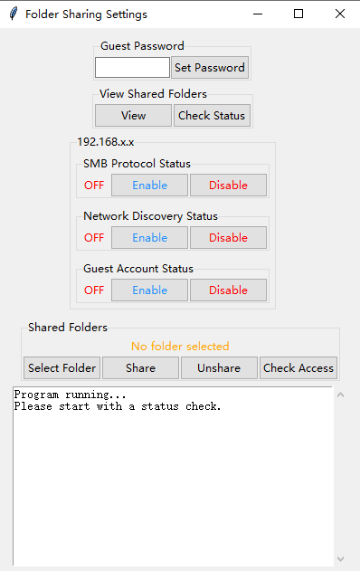
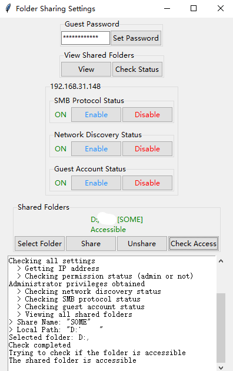

# ShareGuestDir
A python base tool for easily open Guest account and setting share folder.

# Simple UI for this Tool
* When running in CMD
  

* When After running
  

# Simple Requirements
* Python >= 3.9
* Win10 CMD with Administrator privileges
